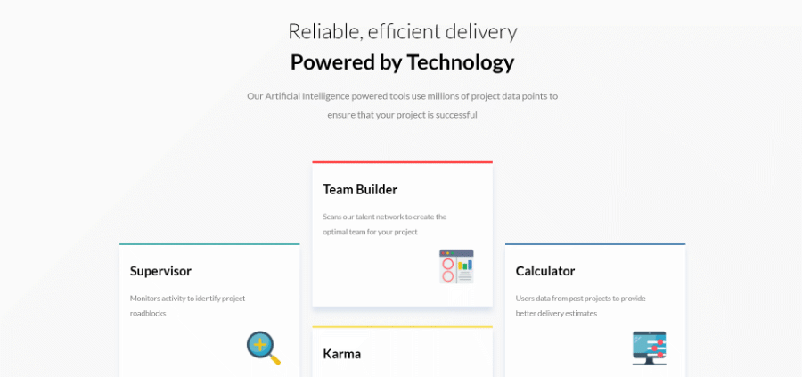
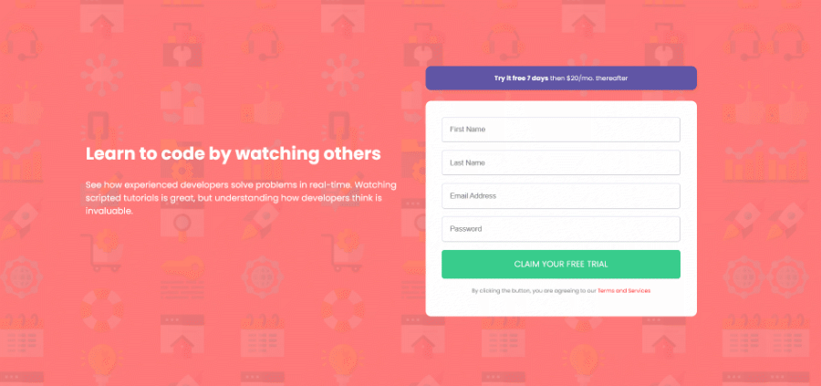
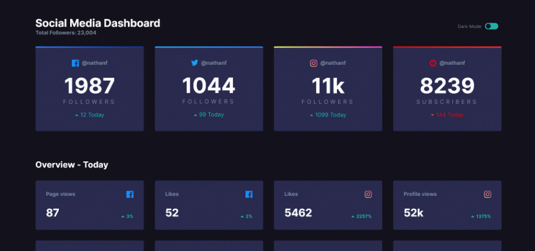
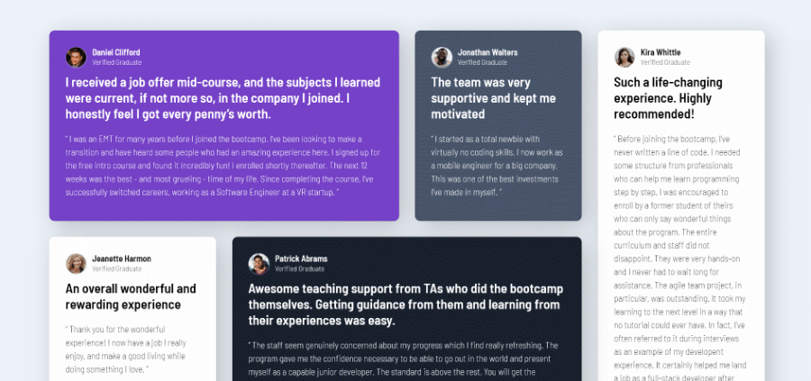

# Frontend Mentor Challenges

> by [Ahmet Alper](https://github.com/ahmetalpergit)

## Introduction

Here you'll find various challenges I've completed on Frontend Mentor to better myself in creating Layouts and Frontend development, overall. Frontend Mentor definitely makes it easier to practice coding by providing starter files and get you in production just like you would in an actual work environment.

### Coming Soon Page

### Four Card Feature Section

### Insure Landing Page

### Into Component with Signup Form

### Social Media Dashboard with Theme Switcher

### Testimonials Grid Section

